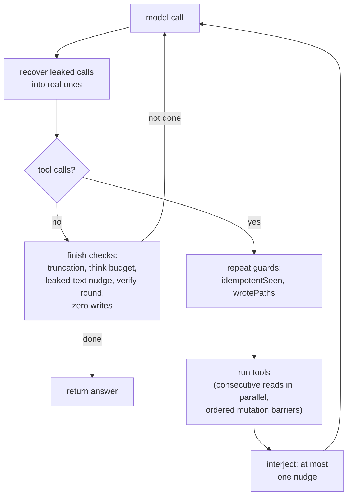

# Architecture

> Installation, flags and usage live in [README.md](README.md). House rules and
> what the build enforces live in [docs/conventions.md](docs/conventions.md).
> This document covers how the system works.

TARS runs one agent loop. Everything else decides how that loop is configured,
what it is allowed to touch, and whether its output is real.

The organising idea: a small local model is unreliable at knowing whether it did
the work. The harness observes file effects and records command results.
Direct runs require `-verify-cmd` for a mechanical completion check; mission
checks are explicit but still only as strong as their acceptance criteria.

## Package map

```
cmd/agent          CLI: flags, the approval gate, console output
cmd/eval           probe runner and scorer

internal/agent     the loop. Tool interface, Registry, repeat detection,
                   budgets, history compaction. Knows nothing about
                   koboldcpp or the filesystem.
internal/llm       Client interface, one backend, the GBNF grammar.
                   Every backend quirk lives here.
internal/tools     concrete tools: file, shell, search, process, delegation,
                   webfetch (SSRF-validated), MCP stdio + HTTP clients,
                   edit hardening, command probes, JSON reducers
internal/roles     the five kinds of agent this project builds
internal/permission allow/ask/deny policy for tool calls (leaf package)
internal/events    JSONL run/step event output for -mode json
internal/session   bounded JSONL checkpoints next to state.json
internal/snapshot  file and Git-index checkpoints, preview and restore
internal/mission   plan, ledger, workers, checks, replan, review
internal/prompts   every prompt, as .txt, embedded at build time
internal/workspace path resolution, project instructions and change observation
```

`llm`, `prompts`, `workspace`, `permission` and `events` import no
other internal package. `session` imports only `llm`. `agent` imports
only `llm`, `prompts`, `permission` and `session`, which is why `tools`
can implement `agent.Tool` without a cycle. `roles` sits above both
because it needs each. The full rule with its enforcement lives in
[docs/conventions.md](docs/conventions.md) under `package-layers` —
this paragraph is a copy, and the test is the original.

## The loop

One model call per step. The response either requests tools or does not, and
those are different paths.



### Judging a step

Four pieces of state decide whether a step made progress, and they answer
different questions:

| State | Question |
|---|---|
| `idempotentSeen` | has this exact read already run with nothing changed since? |
| `wrotePaths` | has this path already been written this run? |
| `stuckSteps` | how many consecutive steps produced no useful result? |
| `exploratorySteps` | how many consecutive steps changed nothing on disk? |

The first two are **hard guards**: a repeat comes back as an error result, so
the model must do something else. Errors do not count as progress, so the stuck
counter keeps climbing if it will not change course.

The last two feed **soft nudges**, and `interject` emits at most one per step,
ranked by severity. Several used to fire together, which meant a worker could
be told to broaden its search and to stop searching in the same breath.

Repeat detection canonicalizes arguments before comparing. `{"path":"x"}` and
`{"path": "x", "metadata_only": false}` are the same call spelled two ways, and
a weak model rarely spells one the same way twice.

### Finishing

A turn with no tool calls is not automatically an answer. Before one is
accepted the loop rules out: generation truncated by the token budget, a
finish attempted on more reasoning than the think budget allows (wrapped
up with a demand for commitment, at most twice per run), a tool call
written as plain text instead of a structured call, a pending verify
round, and — when the run was supposed to write files — a finish with nothing
written. That last case is refused up to `MaxZeroWriteRefusals` times, quoting
the model's own closing sentence back at it.

Well-formed leaked calls never reach these checks: the parser recovers
them into real calls before the branch, so they execute through the
normal tool path. Only the unparseable remainder earns the nudge, and
deliberation inside `<think>` blocks is excluded from both — a sketch is
not a decision. (On llama.cpp backends deliberation arrives out-of-band
in `reasoning_content`; it is measured by the think budget and kept in
history, but likewise never executes.)

Read batches preserve their position relative to exclusive tools. Shell,
background startup, delegation and MCP calls are exclusive because they can
change the shared workspace. All roles inherit the same policy, approval
handler, backend settings and project instructions. File observation includes
shell and delegated effects; mutation invalidates cached reads and previous
verification. Observer failures fail the run closed.

Tool results carry typed failure status alongside model-facing text; the
frontends style failures without guessing from compiler output.

Outcomes distinguish completed, failed and cancelled runs, with measured
paths, verification output and persistence warnings. Session checkpoints
rotate at 16 MiB, retaining the previous log.

### Budgets

Every bound has a default in `agent.New` or the `Runner` methods: 25 steps per
run, 15 per mission worker, 12 per subagent, 8 per inspector, 8192 generation
tokens, 6000 characters of `<think>` deliberation per response before a
wrap-up round (at most 2 per run), 2 stuck steps before a nudge, 2 fix attempts
and 1 replan per mission. Total worker runs per mission are bounded by
construction: `subtasks × (1 + fixes) × (1 + replans)`.

## The five roles

`internal/roles` is the only place that constructs an agent, so "what is a
subagent allowed to do" has one answer rather than one per call site.

| Role | Tools | Bounded by |
|---|---|---|
| `Inspector` | read-only | 8 steps |
| `Subagent` | full set, no delegation or ask_user | 12 steps |
| `Worker` | full set, no delegation | mission's worker budget |
| `Interactive` | full set plus ask_user and delegate_task | run budget |
| `Planner` | read-only, plan-mode prompt | run budget |

An inspector gets a registry without the mutating tools rather than a prompt
asking it not to mutate. A subagent cannot delegate, so delegation cannot
recurse. A planner is an inspector with a different job: investigate and
propose, change nothing — enforced by the same tool-set removal.

## Mission mode

A mission is a state machine over phases — `explore`, `plan`, `execute`,
`verify`, `done`, `failed` — persisted to `.tars/tasks/<id>/mission.json`
after every transition. The model never chooses the next phase. Resume is
"load, switch on phase, continue".

Each subtask runs in a fresh context compiled from the ledger, not inherited
from the previous worker's transcript. A worker that fills its context with
grep output does not poison the plan.

### Checks

A subtask declares how it will be verified: `file_exists`, `file_absent`,
`content_contains`, `shell`, `http` or `none`. The plan is rejected before a human sees it if two
subtasks share a check, if a subtask reads without producing anything, or if a
shell check cannot fail.

The checks are the weak point of the design, not its strength: the model writes
them, and a model that writes its own exam writes an easy one. Validation
catches the known-bad shapes. It does not catch a check that is merely weaker
than the acceptance criteria beside it.

### Fix and replan

A failed check starts a fresh fix worker seeded with the check's real output.
When fix attempts run out, the remaining work is replanned once. Both budgets
are small on purpose: a subtask needing many attempts is usually a planning
failure, and more attempts will not fix a plan.

## The backend boundary

`internal/llm` owns every backend quirk. Three are worth knowing about:

**Grammar.** Requests carry a GBNF grammar that blocks a model from emitting
its native tool-call template as plain text. It constrains the first character
only; it is a patch for two observed shapes, not a response envelope.

**koboldcpp decides tool calls itself.** The server runs its own reasoning pass
to choose whether to emit a tool call and which one. That decision is not
visible to this harness and cannot be constrained by the grammar above. Owning
it means moving to `/api/v1/generate` and taking on per-model chat templating.

**Remote providers take the OpenAI path.** The `openai` backend kind speaks
plain OpenAI chat completions: bearer auth, no grammar field, no local sampler
spellings, structured output via `response_format`. There is no context-window
probe, so the window comes from configuration rather than measurement.

**Streaming is per-backend.** The `openai` and `llama` dialects stream
server-sent events with per-chunk callbacks; koboldcpp refuses and the
loop falls back to unary requests. Streaming changes observability, not
semantics: the assembled response goes through the same finish checks.

**Failures retry; overflows compact.** 429/5xx and dropped connections
retry with backoff (honoring `Retry-After`); aborts surface immediately.
A context-window error never retries — the loop compacts aggressively
and continues, because another attempt at a full context fails the same
way.

## Evals

`eval/probes/*.json` are scenarios with frozen pass criteria, scored three
ways: what the workspace contains, which tools were used, and what the run
reported — plus harness-tail assertions where the probe declares them
(overflow injection, snapshot revert). Each runs in a throwaway copy of
its seed, so fixtures cannot be mutated by a run. Probes that only make
sense on one OS declare `oses` and report SKIP elsewhere rather than
scoring the host. See [eval/README.md](eval/README.md).

The criteria are frozen by hand rather than derived from the mission's own
checks, for the reason given under Checks above.

## Tried and rejected

**Soft nudges alone.** Telling a model it is repeating itself does not stop it
repeating itself. Repeats that can be detected are now refused as errors;
nudges remain only for patterns that cannot be.

**One shared transcript across subtasks.** Context filled with one worker's
exploration, and later workers inherited it. Workers now start from a compiled
seed.

**Trusting `finish_reason` alone.** A truncated generation and a completed one
both arrive as a message with no tool calls, and the truncated one usually
contains the announcement of the call that got cut off.

**Counting repeated tool names as a loop.** Writing four different files in a
row is four `write_file` calls and is also the normal shape of scaffolding
work. Repeat detection compares arguments, not names.

**Nudging a leaked call instead of running it.** A well-formed leak names
a real tool with parseable arguments — unambiguous intent. Refusing it
cost a round-trip the model usually failed again; recovering it into a
real call costs nothing. Only the unparseable remainder earns the nudge.

## Known limitations

- `internal/workspace` bounds the file tools. `run_shell` sets a working
  directory and nothing else, so the workspace is a guardrail against a
  mistyped path, not a sandbox.
- Plan quality is the ceiling. Most mission failures are a bad plan executed
  faithfully, not a subtask executed badly.
- Mission checks are chosen by the model. See Checks.
- Windows-first, but CI runs both Windows and Ubuntu, and OS-bound probes
  declare `oses` and report SKIP elsewhere. The shell tools pick `cmd.exe`
  or `sh` by OS.
